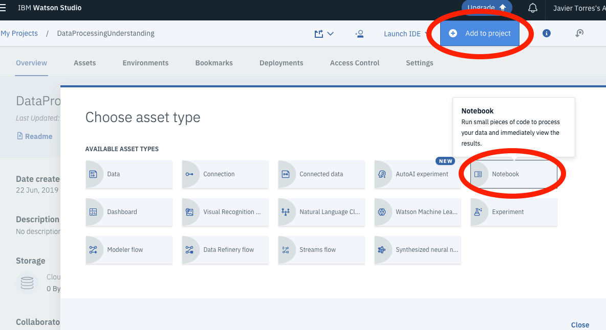

# Visualizing Food Insecurity Data with Pandas and PixieDust

This walkthrough was adapted from the code pattern found here - https://developer.ibm.com/patterns/create-visualizations-to-understand-food-insecurity/

## Components & Technologies

- [IBM Watson Studio](https://www.ibm.com/cloud/watson-studio): Analyze data using RStudio, Jupyter, and Python in a configured, collaborative environment that includes IBM value-adds, such as managed Spark.
- [Jupyter Notebook](https://jupyter.org/): An open source web application that allows you to create and share documents that contain live code, equations, visualizations, and explanatory text.
- [PixieDust](https://github.com/pixiedust/pixiedust): Provides a Python helper library for IPython Notebook.
- [Python](https://www.python.org/): Python is a programming language that lets you work more quickly and integrate your systems more effectively.
- [Pandas](https://pandas.pydata.org/): A Python library providing high-performance, easy-to-use data structures.

## Setup and Run

1. Open Watson Studio by logging in at [https://dataplatform.ibm.com](https://dataplatform.ibm.com)

1. From the dashboard page, Click the **`Get started`** drop down menu on the top right of the page and then Click on the **`Create a project`** option to create a new project on Watson Studio.

    

1. Select `Standard` as the type of project to create.

1. Give your project a name and click **`Create`** on the bottom right.

    

1. Click the `Assets` tab near the top of the page.

1. Add a new notebook. Click `Add to project` and choose `Notebook`:

   

1. Choose new notebook `From File`. Give your notebook a name and choose the notebook file from the downloaded repository (`dsai_dataprocessing/notebooks/DietDiseaseExploration.ipynb`).

   

1. For `Runtime` you can leave the default option and then click `Create Notebook`.

1. The notebook will load, use the instructions in the notebook by running through the cells. Click the `(►) Run` button to start stepping through the notebook.

## Analyzing output

By reviewing our visualizations both in Watson Studio and Watson, we learn that obesity and diabetes almost go hand in hand, along with food insecurity. We can also learn that this seems to be an inequality issue, both in income and race, with Black and Hispanic populations being more heavily impacted by food insecurity and diet-related diseases than those of the White and Asian populations. We can also see that school-aged children who qualify for reduced lunch are more likely obese than not whereas those that have a farm-to-school program are more unlikely to be obese.
