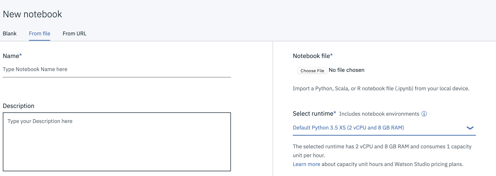

# Data Science Process Pipeline in action to solve Employee Attrition Problem

This walkthrough was adapted from the code pattern found here - https://developer.ibm.com/patterns/data-science-life-cycle-in-action-to-solve-employee-attrition-problem/

This code pattern is analyzing the employee attrition problem. The dataset used in the code pattern is supplied by [Kaggle](https://www.kaggle.com/) and contains HR analytics data of employees that stay and leave. The types of data include metrics such as education level, job satisfactions, and commmute distance.

The data is made available under the following license agreements:

### Dataset License Details

| Asset | License | Source Link |
| ------------- | --------  | -------- |
| [Employee Attrition Data - Database License](data/emp_attrition.csv) | [Open Database License (ODbL)](https://opendatacommons.org/licenses/odbl/1.0/) | [Kaggle](https://www.kaggle.com/pavansubhasht/ibm-hr-analytics-attrition-dataset/home) |
| [Employee Attrition Data - Content License](data/emp_attrition.csv) | [ Database Content license (DbCL)](https://opendatacommons.org/licenses/dbcl/1.0/) | [Kaggle](https://www.kaggle.com/pavansubhasht/ibm-hr-analytics-attrition-dataset/home) |

## Components & Technologies

* [IBM Watson Studio](https://www.ibm.com/bs-en/marketplace/data-science-experience): Analyze data using RStudio, Jupyter, and Python in a configured, collaborative environment that includes IBM value-adds, such as managed Spark.
* [Jupyter Notebook](http://jupyter.org/): An open source web application that allows you to create and share documents that contain live code, equations, visualizations, and explanatory text.
* [Artificial Intelligence](https://medium.com/ibm-watson): Artificial intelligence can be applied to disparate solution spaces to deliver disruptive technologies.
* [Data Science](https://medium.com/ibm-watson): Systems and scientific methods to analyze structured and unstructured data in order to extract knowledge and insights.
* [Python](https://www.python.org/): Python is a programming language that lets you work more quickly and integrate your systems more effectively.
* [Pandas](http://pandas.pydata.org/): A Python library providing high-performance, easy-to-use data structures.
* [Scikit-Learn](https://scikit-learn.org/stable/#): Free software machine learning library for the Python programming language.
* Data Visualization tools: Bokeh, Matplotlib, Seaborn, Pygal and Plotly.

## Steps

1. [Create a new Watson Studio project](#1-create-a-new-watson-studio-project)
1. [Create the notebook](#2-create-the-notebook)
1. [Run the notebook](#3-run-the-notebook)
1. [Save and Share](#4-save-and-share)

> Note: if you would prefer to skip the following steps and just follow along by viewing the completed Notebook, simply:
> * View the completed [notebook](examples/employee-attrition.ipynb) and its outputs, as is.
> * While viewing the notebook, you can optionally download it to store for future use.

## Setup and Run

1. Open Watson Studio by logging in at [https://dataplatform.ibm.com](https://dataplatform.ibm.com)

1. From the dashboard page, Click the **`Get started`** drop down menu on the top right of the page and then Click on the **`Create a project`** option to create a new project on Watson Studio.

    

1. Select `Standard` as the type of project to create.

1. Give your project a name and click **`Create`** on the bottom right.

    

1. Click the `Assets` tab near the top of the page.

1. Add a new notebook. Click `Add to project` and choose `Notebook`:

   

1. Choose new notebook `From File`. Give your notebook a name and choose the notebook file from the downloaded repository (`dsai_dataprocessing/notebooks/EmployeeAttrition-DataUnderstanding.ipynb`).

   

1. For `Runtime` you can leave the default option and then click `Create Notebook`.

1. The notebook will load, use the instructions in the notebook by running through the cells. Click the `(►) Run` button to start stepping through the notebook.

* **TIP:** Once successfully imported, the notebook should appear in the `Notebooks` section of the `Assets` tab.
